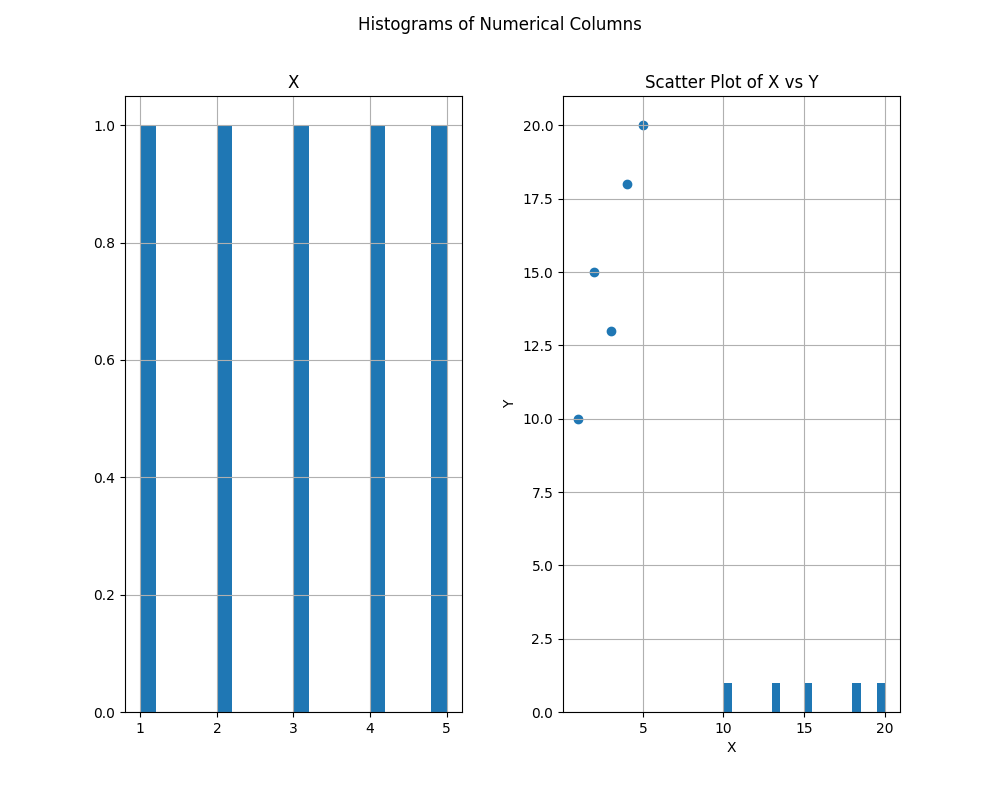

# Statistical Analysis and Plot Generation Application

1. - Introduction
Provide a brief overview of the purpose and goals of the application. Mention the key functionalities, such as reading and parsing CSV files, performing statistical analysis, generating plots, and utilizing GPT-3 for insights.

2. - Design
- 2.1 Architecture
Explain the high-level architecture of the application, including the main components and their interactions. Discuss the modular structure, breaking down the code into smaller functions for better readability and maintainability.

- 2.2 Error Handling
Detail the error-handling mechanisms implemented in the application, emphasizing specific error messages and the use of the logging module for better traceability.

- 2.3 Configurability
Describe how the application allows for configurability through command-line arguments or a configuration file. Highlight the ability to set the CSV file path, OpenAI API key, and other configurations.

3. - Implementation
- 3.1 Reading and Parsing CSV Files
Discuss the implementation of the function responsible for reading and parsing CSV files. Mention any specific considerations or challenges addressed in this process.

- 3.2 Statistical Analysis
how the application performs basic statistical analysis on the input DataFrame. Provide insights into the calculations for mean values, median values, standard deviation, and correlation coefficients.

- 3.3 Plot Generation
the process of generating histograms and scatter plots based on the input DataFrame. Discuss the use of labels, titles, and legends for better interpretation.

- 3.4 GPT-3 Interaction
 how the application interacts with GPT-3 to obtain insights about the data. Explain the questions asked and the format of the GPT-3 responses.

4. - Security
security measures implemented in the application, emphasizing the avoidance of hardcoding sensitive information like API keys directly in the code. Recommend the use of environment variables or configuration files for security.

5. - Visualization
visualization choices made, including the use of basic matplotlib for plots. Suggest potential improvements, such as exploring advanced visualization libraries like Seaborn or Plotly for enhanced plots.

6. - Conclusion
 key points discussed in the report, highlighting the successful implementation of the application's functionalities.

7. - Future Improvements
Discuss potential future improvements or features that could enhance the application, such as additional statistical metrics, more advanced visualizations, or improved GPT-3 interactions.

# Technology Used
- Python
- OpenAI
- Pandas

# How to Start

- pip install -r requirements.txt

- python main.py data/sample_data.csv --save_plots --plot_path plots

